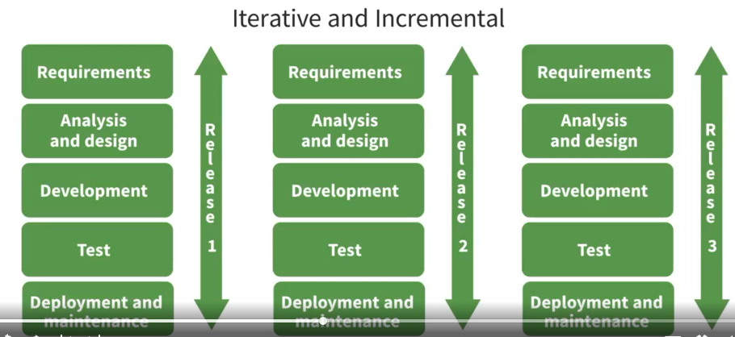
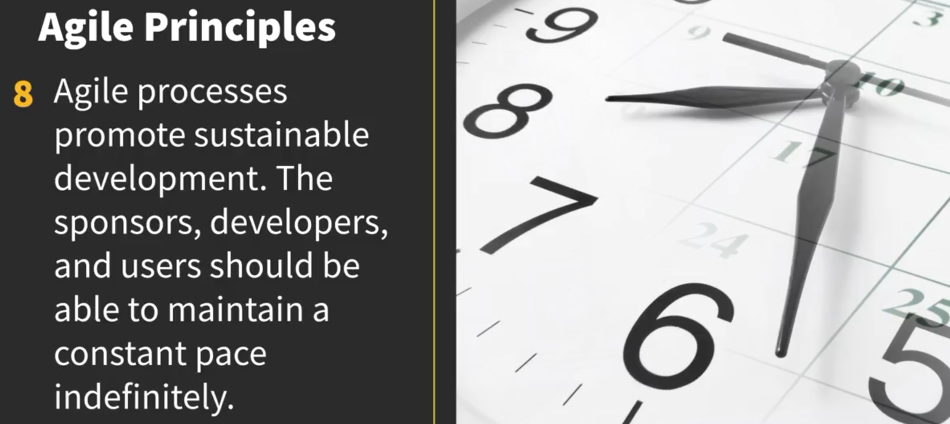
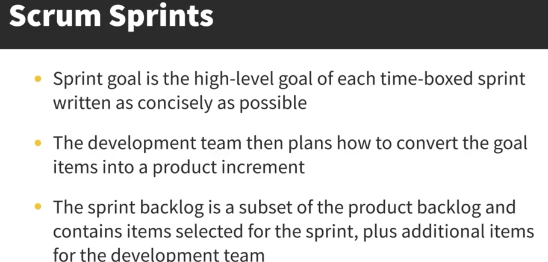

# agile-software-development
# Software Crisis and the Rise of Agile Methodologies

## Overview
The **software crisis** refers to the challenges of creating efficient and useful software within defined timelines. Traditional methods, inspired by manufacturing and construction, struggled to adapt to the dynamic nature of software development. This led to the rise of **Agile methodologies**, which prioritize flexibility, collaboration, and iterative progress.

---

## The Waterfall Model

The **Waterfall Model** was an early approach to software development, mimicking manufacturing and construction processes. It consists of five phases:
1. **Requirements**
2. **Analysis and Design**
3. **Development**
4. **Testing**
5. **Deployment and Maintenance**

Each phase has frozen deliverables that act as inputs for the next phase.

### Issues with Waterfall:
1. **Late Customer Feedback**: Customers don’t see the product until late in the process, often leading to mismatched expectations or outdated solutions.
2. **Inflexibility**: Changes are costly and discouraged, making it hard to adapt to market shifts or new requirements.
3. **Top-Down Management**: Prioritizes processes over people, with strict checklists and controls that limit team creativity and adaptability.

---

## The Need for Change
- **High Failure Rates**:
- **Dynamic Nature of Software**: Unlike manufacturing, software requirements often change, and teams need flexibility to adapt.

---

## Enter Agile Methodologies
Agile methodologies emerged as a solution to the limitations of Waterfall. Key principles include:
- **Iterative Development**: Deliver working software in small, incremental updates.
- **Customer Collaboration**: Involve customers early and often to ensure alignment.
- **Adaptability**: Embrace change and respond to evolving requirements.
- **People Over Processes**: Empower teams to make decisions and innovate.

---

## Why Agile?
Agile addresses the shortcomings of Waterfall by focusing on:
- **Early and Continuous Delivery**: Deliver value faster and gather feedback sooner.
- **Flexibility**: Adapt to changing market conditions or customer needs.
- **Team Empowerment**: Encourage collaboration and creativity over rigid processes.

# Software Crisis and the Rise of Agile Methodologies

## Overview
The **software crisis** refers to the challenges of creating efficient and useful software within defined timelines. Traditional methods, inspired by manufacturing and construction, struggled to adapt to the dynamic nature of software development. This led to the rise of **Agile methodologies**, which prioritize flexibility, collaboration, and iterative progress.

---

## The Waterfall Model
The **Waterfall Model** was an early approach to software development, mimicking manufacturing and construction processes. It consists of five phases:
1. **Requirements**
2. **Analysis and Design**
3. **Development**
4. **Testing**
5. **Deployment and Maintenance**

Each phase has frozen deliverables that act as inputs for the next phase.

### Issues with Waterfall:
1. **Late Customer Feedback**: Customers don’t see the product until late in the process, often leading to mismatched expectations or outdated solutions.
2. **Inflexibility**: Changes are costly and discouraged, making it hard to adapt to market shifts or new requirements.
3. **Top-Down Management**: Prioritizes processes over people, with strict checklists and controls that limit team creativity and adaptability.

---

## The Need for Change
- **High Failure Rates**: 
  - A 1994 Standish Group report found only **16%** of projects were completed on time, within budget, and with all features.
  - **53%** of projects faced issues like budget overruns, missed deadlines, or incomplete features.
  - By 2000, **85%** of software projects were considered failures.

- **Dynamic Nature of Software**: Unlike manufacturing, software requirements often change, and teams need flexibility to adapt.

---

## Agile to the Rescue
### Why Agile?
- **Change is Inevitable**: Requirements shift due to technology changes, mergers, competition, or team dynamics.
- **Empirical Process**: Software development relies on real-world feedback and iterative improvements.
- **Iterative Development**: Software is built in small increments, with each iteration producing a usable product.
  - Steps include requirements capture, refinement, design, coding, testing, deployment, and maintenance.
- **Risk Management**: Agile allows teams to address risks and uncertainties at every stage.

---

## The Agile Manifesto (2001)
The Agile Manifesto defines the core principles of Agile methodologies. Its four tenets are:
1. **Individuals and Interactions** over processes and tools.
2. **Working Software** over comprehensive documentation.
3. **Customer Collaboration** over contract negotiation.
4. **Responding to Change** over following a plan.

### Key Notes:
- Agile does not reject processes, tools, documentation, contracts, or plans. It simply prioritizes the four tenets.
- The Agile Manifesto reflects the collective wisdom of industry leaders, providing a mindset suited for complex, unpredictable environments.

---

## Why Agile?
Agile addresses the shortcomings of Waterfall by focusing on:
- **Early and Continuous Delivery**: Deliver value faster and gather feedback sooner.
- **Flexibility**: Adapt to changing market conditions or customer needs.
- **Team Empowerment**: Encourage collaboration and creativity over rigid processes.

---

# Software Crisis and the Rise of Agile Methodologies

## Overview
The **software crisis** refers to the challenges of creating efficient and useful software within defined timelines. Traditional methods, inspired by manufacturing and construction, struggled to adapt to the dynamic nature of software development. This led to the rise of **Agile methodologies**, which prioritize flexibility, collaboration, and iterative progress.

---

## The Waterfall Model
The **Waterfall Model** was an early approach to software development, mimicking manufacturing and construction processes. It consists of five phases:
1. **Requirements**
2. **Analysis and Design**
3. **Development**
4. **Testing**
5. **Deployment and Maintenance**

Each phase has frozen deliverables that act as inputs for the next phase.

### Issues with Waterfall:
1. **Late Customer Feedback**: Customers don’t see the product until late in the process, often leading to mismatched expectations or outdated solutions.
2. **Inflexibility**: Changes are costly and discouraged, making it hard to adapt to market shifts or new requirements.
3. **Top-Down Management**: Prioritizes processes over people, with strict checklists and controls that limit team creativity and adaptability.

---

## The Need for Change
- **High Failure Rates**: 
  - A 1994 Standish Group report found only **16%** of projects were completed on time, within budget, and with all features.
  - **53%** of projects faced issues like budget overruns, missed deadlines, or incomplete features.
  - By 2000, **85%** of software projects were considered failures.

- **Dynamic Nature of Software**: Unlike manufacturing, software requirements often change, and teams need flexibility to adapt.

---

## Agile to the Rescue
### Why Agile?
- **Change is Inevitable**: Requirements shift due to technology changes, mergers, competition, or team dynamics.
- **Empirical Process**: Software development relies on real-world feedback and iterative improvements.
- **Iterative Development**: Software is built in small increments, with each iteration producing a usable product.
  - Steps include requirements capture, refinement, design, coding, testing, deployment, and maintenance.
- **Risk Management**: Agile allows teams to address risks and uncertainties at every stage.

---

## The Agile Manifesto (2001)
The Agile Manifesto defines the core principles of Agile methodologies. Its four tenets are:
1. **Individuals and Interactions** over processes and tools.
2. **Working Software** over comprehensive documentation.
3. **Customer Collaboration** over contract negotiation.
4. **Responding to Change** over following a plan.

### Key Notes:
- Agile does not reject processes, tools, documentation, contracts, or plans. It simply prioritizes the four tenets.
- The Agile Manifesto reflects the collective wisdom of industry leaders, providing a mindset suited for complex, unpredictable environments.

---

## Agile Principles
The Agile Manifesto is supported by **12 principles** that guide Agile methodologies. Key principles include:

1. **Customer Satisfaction**: 

   - Deliver valuable software early and continuously.
   - Prioritize backlog items by business value.

2. **Embrace Change**: 

   - Welcome changing requirements, even late in development.
   - Reprioritize backlog items to accommodate changes.

3. **Frequent Delivery**: 

   - Deliver working software frequently (weeks to months).
   - Shorter timescales are preferred for faster feedback.

4. **Collaboration**: 
   - Business people and developers must work together daily.
   - Joint ownership and close cooperation are essential.

5. **Motivated Teams**: 

   - Build projects around motivated individuals.
   - Provide support, trust, and a servant leadership approach.

6. **Face-to-Face Communication**:
 
   - The most effective method of conveying information is face-to-face conversation.
   - For remote teams, video communication is preferred over audio.

---

# Agile Principles

## Key Agile Principles  

1. **Working Software as a Measure of Progress**  

   - Deliver functional software to customers early and often.  
   - Progress is measured by delivering increments of products that provide business value.  

2. **Sustainable Development**  
   - Maintain a sustainable pace for the team.  
   - Avoid burnout by ensuring the pace is productive and long-term sustainable.  
   - Overwork leads to stress, conflicts, and reduced productivity.  

3. **Technical Excellence and Good Design**  

   - Continuous focus on technical excellence enhances agility.  
   - Employ practices like test-driven development, test automation, and adherence to architectural standards.  

4. **Simplicity**  

   - Focus on maximizing the amount of work *not* done.  
   - Avoid overcomplicating solutions—meet requirements in the simplest manner.  
   - Prevent analysis paralysis and unnecessary enhancements.  

5. **Self-Organizing Teams**  
   - Teams operate independently with minimal external assistance.  
   - Optimal architectures, requirements, and designs emerge from self-organizing teams.  

6. **Inspect and Adapt**  

   - Regularly reflect on processes and identify ways to improve.  
   - Adjust team behavior to enhance efficiency and effectiveness.  

# Agile Overview  

## Agile Principles  
- Focuses on **continuous delivery**, **improvement**, **collaboration**, and **adaptability to change**.  

## Scrum Framework  
- **Roles**:  
  - **Product Owner**: Manages the product backlog and defines priorities.  
  - **Development Team**: Delivers increments of the product.  
  - **Scrum Master**: Facilitates the process and removes obstacles.  
- **Events**: Sprint planning, daily stand-ups, sprint reviews, and retrospectives.  
- **Artifacts**: Product backlog, sprint backlog, and increments.  

## Agile Techniques  
- **Extreme Programming (XP)**: Emphasizes technical practices like frequent releases and pair programming.  
- **Test-Driven Development (TDD)**: Write tests before writing the code to ensure quality.  
- **Kanban**: Visualizes workflow and limits work in progress to enhance focus and efficiency.  

 # Why Scrum?

Scrum is a framework for managing and completing complex projects efficiently. It emphasizes iterative progress through defined roles, artifacts, and ceremonies. Below is an overview of Scrum components:

## Scrum Framework Components
- **Product Backlog**: A prioritized collection of requirements and sub-requirements.
- **Sprint Planning**: A meeting to create a Sprint Backlog.
- **Sprint Backlog**: Tasks selected from the Product Backlog to be completed in a Sprint.
- **Scrum Team**: Cross-functional team comprising:
  - Product Owner
  - Scrum Master
  - Development Team Members
- **Daily Scrum**: A daily standup meeting to discuss:
  - Backlog
  - Sprint Backlog
  - Increment
  - Team Roles
- **Sprint Review**: Demonstrates the increment to stakeholders.
- **Sprint Retrospective**: Reflects on improvements and plans actionable changes.
- **Increment**: A usable product delivered at the end of a Sprint.

## Artifacts
1. **Product Backlog**
2. **Sprint Backlog**
3. **Burn Down Chart**: Tracks the progress of completed tasks.

## Ceremonies
1. **Sprint Planning**
2. **Daily Scrum**
3. **Sprint Review**

---

## Key Definitions

- **Done**: The agreed-upon criteria that must be met for an increment to be considered complete.
- **Waterfall**: A linear project management methodology where each phase must be completed before moving to the next.
- **Standup**: A brief daily meeting to discuss progress, roadblocks, and plans.
- **User Stories**: Simple descriptions of a feature from the user’s perspective.

---

## Workflow
- The Scrum Team works iteratively on the Sprint Backlog.
- Remaining tasks from the current Sprint are carried forward to the next Sprint Backlog.
- During the **Sprint Retrospective**, the team reflects on:
  - What worked well
  - What could be improved
  - Commitments for the next Sprint

Actionable improvements are planned during this session.

---

## Cross-Functional Teams
A Scrum Team must be cross-functional to deliver increments without dependencies on external teams.

---

## Scrum Board

- **Story**
- **To Do**
- **In Progress**
- **To Verify**
- **Done**: Tasks are only moved here when 100% complete.

---

## Kanban Board

- **Kanban** is a pull-based system. Tasks are taken up only when there is bandwidth.
- **Workflow**: Visualizes the progress of tasks.
- **Kanban Cards**: Represent individual tasks on the board.

---

## Scrum vs. Kanban
| **Aspect**            | **Scrum**                              | **Kanban**                          |
|-----------------------|----------------------------------------|-------------------------------------|
| **Framework**         | Time-boxed Sprints                    | Continuous Flow                    |
| **Roles**             | Product Owner, Scrum Master, Team     | None explicitly defined            |
| **Focus**             | Deliverables per Sprint               | Reducing work-in-progress (WIP)    |
| **Best For**          | Iterative Product Development         | Managing workflows efficiently     |

## Which is Best?
The choice between Scrum and Kanban depends on project requirements:
- Use **Scrum** for structured product development.
- Use **Kanban** for continuous, flexible workflows.

